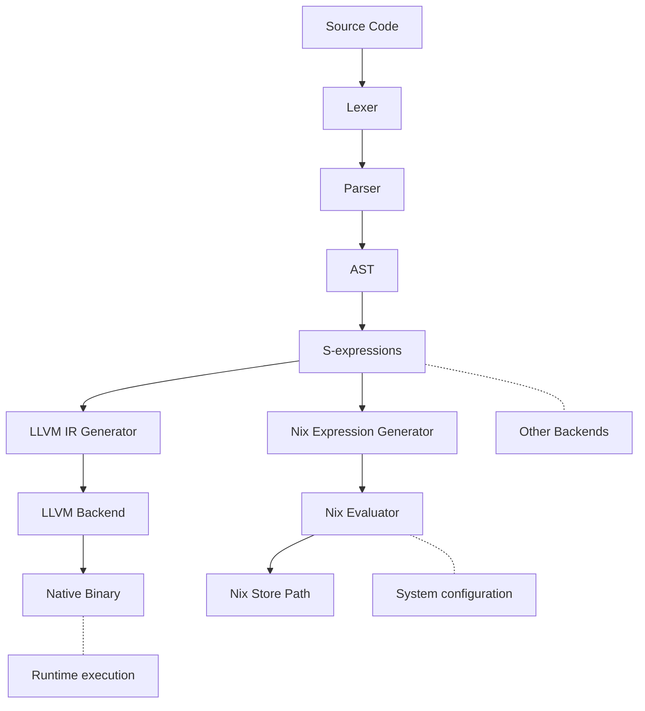

# Arcane Compiler

Based on my infatuation with Elixir and Odin, along with practicalities of JS

TLDR - A hammer so I can see the world as a nail

### Syntax Pending
```elixir
UserStore.Users :: module => 

  @doc "Creates a user"
  @pub createUser() -> {:ok, User.t()}
  createUser :: () =>
    # Type declaration is always -> at the end of a statement
    user = Repo.create(User) -> User.t()

    # Type inference is a familiar <-
    user <- Repo.create(User) 

    # Pattern matching also available
    %User{} = user <- Repo.create(User)

    {:ok, user}
  end

  @pub renderUser(^User.t()) -> :ok
  renderUser :: (user) =>
    stop = false -> boolean()

    # Uninitialized variables are always set to nil
    # Size always set to the maximum of their type
    input -> Arcane.UserLand.KeyboardInput.t()

    Arcane.Loop.infinite(() =>
      drawUser(user)
      input = Arcane.UserLand.gatherInput()

      Arcane.Loop.exitOn(input.keydown == "C" and input.modifier == "Ctrl")
    end)

    IO.puts("Ctrl-C Pressed. Goodbye")
  end

  @pub validUserDoc(String.t()) -> boolean()
  validUserDoc :: (filename) =>
    using
      file <- Arcane.File.open(filename)
      metric <- Arcane.Metrics.connect() 
    =>
     result <- 
       file
       |> Arcane.File.read_line()
       |> Stream.map(line) =>
         contains_arcane = String.contains?(line, "ARCANE IS NEAT")
         Metrics.increment(metric, "user_likes_arcane", contains_arcane)
         contains_arcane
       end
       |> Stream.find(line => line == true)

      result || false
    end
  end

  @doc """
  Given a User, update it with a map of arguments
  Multi-line string
  """
  @pub updateUser(^User.t(), map()) -> {:ok, user} | {:error, String.t()} 
  updateUser :: (user_ref, values) =>
    # Pass by reference
    checkForUpdates(user_ref)

    # referencing/deferencing via keywords `ref` and `deref`

    # String concatenation + dereferencing
    values = Map.put(values, :name, "#{deref(user_ref).first} Apple")

    result <-
        user_ref
        |> deref
        |> User.changes(values)
        |> Repo.update()

    match result =>
      {:ok, user} :: {:ok, user}
      {:error, _} :: {:error, "Failed to update user"}
    end
  end

  @priv checkIfBob(User.t()) -> {:ok, true} | {:ok, false} 
  checkIfBob :: ~p(user) => 
   match user =>
     %User{name: "Bob"} :: {:ok, true}
     _user :: {:ok, false}
   end
  end 
end
```



Documentation can be generated with [ExDoc](https://github.com/elixir-lang/ex_doc)
and published on [HexDocs](https://hexdocs.pm). Once published, the docs can
be found at <https://hexdocs.pm/arcane>.

