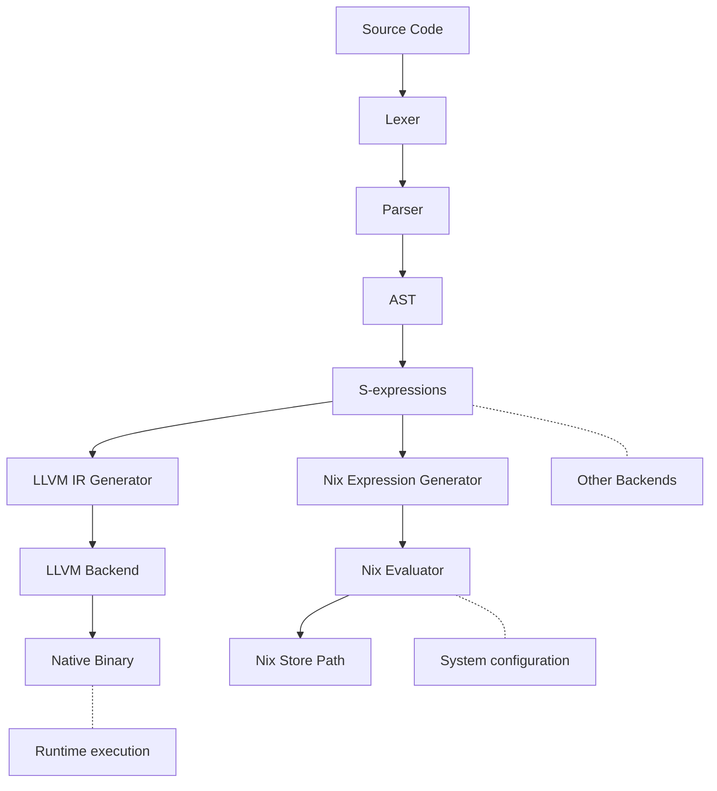

# JoeLang

Yeah I am vain enough to name a language after myself. 

Seriously though I dislike that elixir is bad for systems applications, and I don't like 
the available system language options much more. JoeLang is an attempt to create a language 
that gets out of your way and lets you get stuff done.. without creating a mess.



## Installation

If [available in Hex](https://hex.pm/docs/publish), the package can be installed
by adding `s_expr` to your list of dependencies in `mix.exs`:

```elixir
def deps do
  [
    {:s_expr, "~> 0.1.0"}
  ]
end
```

Documentation can be generated with [ExDoc](https://github.com/elixir-lang/ex_doc)
and published on [HexDocs](https://hexdocs.pm). Once published, the docs can
be found at <https://hexdocs.pm/s_expr>.

