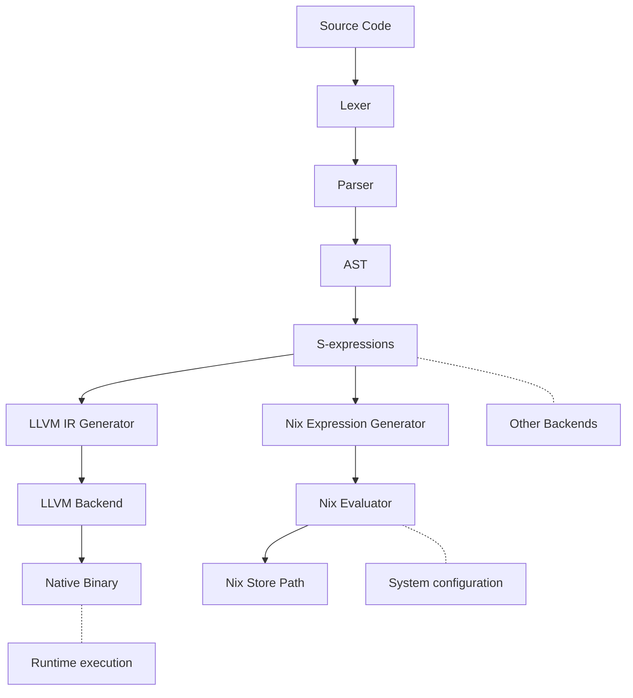

# JoeLang Compiler (Name Pending)

Based on my infatuation with Elixir and Odin, along with practicalities of JS

TLDR - A hammer so I can see the world as a nail

### Syntax Pending
```elixir
UserStore.Users :: module => 

  createUser :: () : () -> {:ok, User.t()} => 
   user = Repo.create(User) ~t(User.t())
   #equivalent
   user ~= Repo.create(User)
   #equivalent
   %User{} = user := Repo.create(User)

   {:ok, user}
  end

  updateUser :: (ref user, values) : (^User.t(), map()) -> {:ok, user} | {:error, String.t()} =>
    #Pass by reference
    checkForUpdates(user)

    user
    |> deref
    |> User.changes(values)
    |> Repo.update()
    =|> 
      {:ok, user} -> {:ok, user}
      {:error, reason} -> {:error, reason}
  end
 
  checkIfBob :: ~p(user) : (User.t()) -> {:ok, true} | {:ok, false} => 
   case user =>
     %User{name: "Bob"} -> {:ok, true}
     _user -> {:ok, false}
   end
  end 
end
```



Documentation can be generated with [ExDoc](https://github.com/elixir-lang/ex_doc)
and published on [HexDocs](https://hexdocs.pm). Once published, the docs can
be found at <https://hexdocs.pm/s_expr>.

