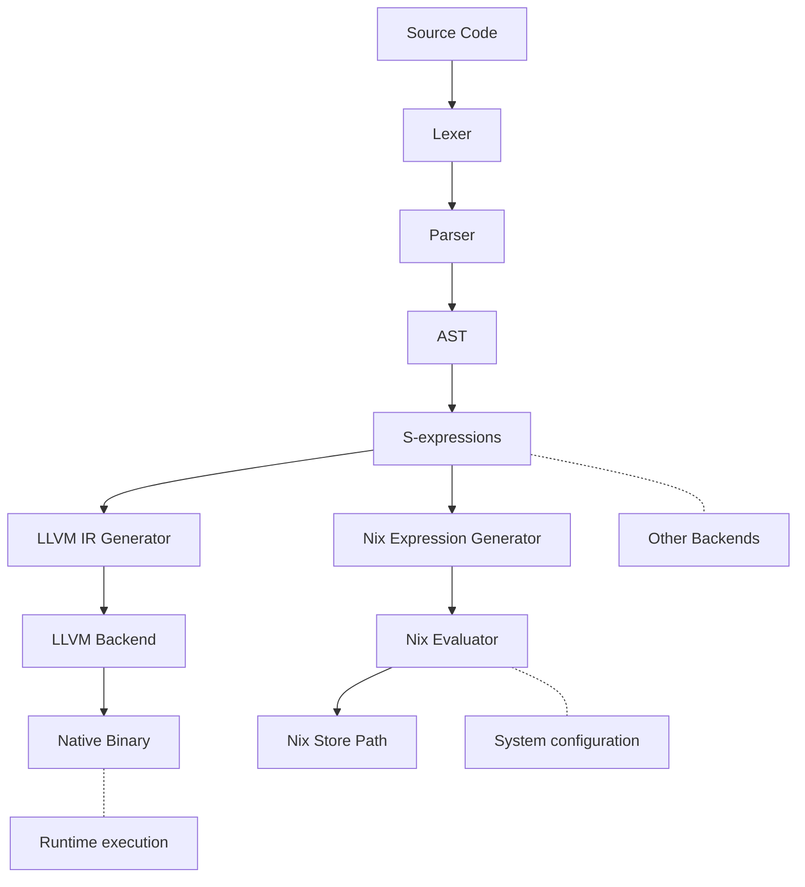

# Arcane Compiler

Based on my infatuation with Elixir and Odin, along with practicalities of JS

TLDR - A hammer so I can see the world as a nail

### Syntax Pending
```rust

// Everything is a module. This is familiar to Elixir,
// but differs in that there are explicit declarations for
// dependencies, behaviours, macros, and system deps.
Arcane.Users :: module (
  deps: [],
  sys: [],
  expands: [],
  contracts: []
) => {
    // Arrow Syntax from JS
    // Type system for declaring new types
    __MODULE__ :: struct  => {
        name: "" -> String.t(),
        email: "" -> String.t()
    }

    // Declaration syntax from Odin/Jai
    searchUser(%{email: String} | %{name: String}) -> __MODULE__ :: args@(
        // Automatic variable binding: email maps to `email: email`
        (%{email}) => Repo.get_by(email: email)
        (%{name}) => Repo.get_by(name: name)
        _args => Error("Invalid Args")
    )

    getUsers(String) -> __MODULE__ :: (name) => {
    //Using creates a block which automatically cleans after scope close
        using
            arena <- Arena.new(1024 * 1024),
            repo <- Repo.connect(),
            file <- File.write("data.txt") => {

            // Arenas are part of the standard library to help create predictable performance
            twenty_four <- Arena.alloc(24, arena)
            // Type declaration after statement
            query = String.new("select * from users where name = '#{name}'", arena) -> String

            // implicit type casting
            result <- Repo.query(query, repo, arena)

            // Nix like matching handles conditionals
            return result@(
                Ok(data) => File.write(data, file),
                Error(msg) => Error(msg)
            )
        // Arena, Repo, and File would all call dispose() after the scope ends

        // Catch statement familiar to with/else in Elixir
        catch
            error@ConnectError(msg) => Error("failed to connect ${msg}"),
            error@WriteError(msg) => Error("failed to write ${msg}")
            error => Error("Unexpected: ${msg}")
        }
    }

    createUser(String, String) -> __MODULE__ :: (name, email) => {
        user = 
            __MODULE__.new()
            |> Map.put(:name, name)
            |> Map.put(:email, email)
            |> ensure_unique() ?? return Error("User already exists")

        return user
    }

    /**
    * Docs attached to function headers via multi line comments
    */
    getAllNames(^list(User), list(User)) -> String.t() :: args@(
        // Looping is done via recursion. The compiler is TCO'd so that it performs and behaves the same as loops
        // via jump/jump not equal
        // Head/Tail recursion available
        (users*@[user | rest], out = []) => {
            out = [user.name | out]
            
            return getAllNames(rest, out)
        },

        // Matching on an empty string, and a list with User types
        (users*@[], out@list(User)) => Arcane.List.reverse(out)
    )
}
```



Documentation can be generated with [ExDoc](https://github.com/elixir-lang/ex_doc)
and published on [HexDocs](https://hexdocs.pm). Once published, the docs can
be found at <https://hexdocs.pm/arcane>.

